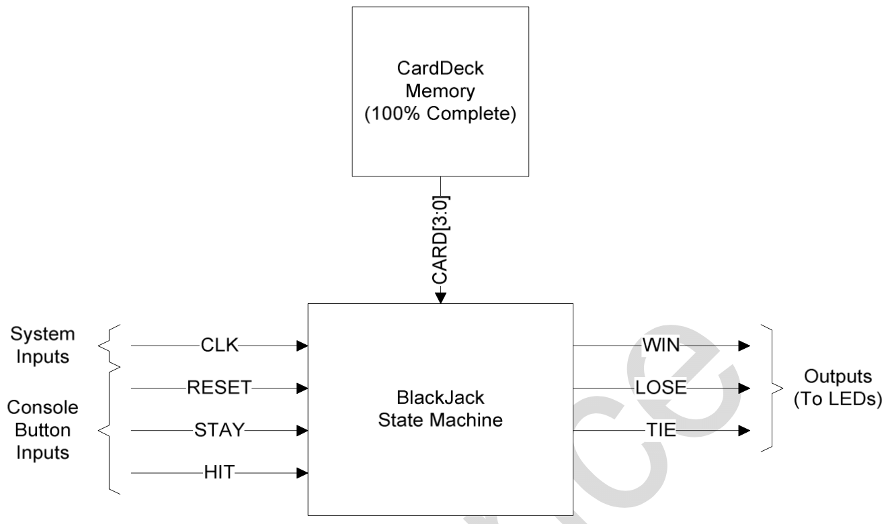

# Projeto Final - BlackJack

Prof. João Carlos Bittencourt

Centro de Ciências Exatas e Tecnológicas

Universidade Federal do Recôncavo da Bahia, Cruz das Almas

> Não utilize soluções prontas, para evitar prejuízos na conclusão desta atividade e na condução do seu aprendizado. Caso seja identificada e atestado que o código foi parcial ou completamente copiado, o produto será anulado.

## Introdução

Este documento descreve a especificação do projeto final do nosso curso. Nele você deve desenvolver uma máquina de estados finitos que implementa um console para o jogo blackjack.

Blackjack ou "21" é um jogo de cartas simples, jogado por um único jogador e um _dealer_. O objetivo do jogo é ter uma "mão" mais alta do que o _dealer_ sem ultrapassar 21. A mão corresponde à soma total das cartas que o jogador detém.

O jogo começa com o _dealer_ distribuindo ao jogador e a ele mesmo duas cartas. O jogador possui duas opções de jogada: (i) pegar uma nova carta (_hit_); ou (ii) não pegar mais cartas até o final do jogo (_stay_). O jogador perderá se o somatório das cartas em sua mão ultrapassar 21. Caso contrário, o jogador aguarda pelas cartas do _dealer_. O _dealer_ poderá realizar um _hit_ ou _stay_, dependendo da soma da cartas na sua mão. O _dealer_ perderá para o jogador se a sua mão ultrapassar 21. Caso contrário, quem quer que possua o maior valor na mão ganha a partida. A partida pode terminar empatada se ambas o jogador e o _dealer_ tiverem mãos iguais.

Os valores das cartas são definidos de acordo com a regra apresentada a seguir.

- A (Ás) = 1 ou 11
- 2 até 9 = o seu valor numérico
- 10, J, Q, K = 10

## Especificações

Você deve projetar uma máquina de estados para um jogo blackjack eletrônico portátil. O console do jogo terá três botões: **HIT**, **STAY** e **RESET**, os quais permitem ao jogador controlar sua mão de cartas e reiniciar o jogo quando terminar. As cartas virão de um circuito existente, e você pode assumir que os elas já estão embaralhadas (randomizadas) e prontas para serem distribuídas.

O jogo inicia ligando o console e pressionando o botão de _reset_ para inicializar os circuitos. Uma vez que os circuitos tenham sido inicializados, a máquina de estados começará a distribuir as cartas conforme descrito nas regras do blackjack definidas acima. Depois que as primeiras cartas forem distribuídas, o jogador terá a opção de pegar cartas adicionais do _dealer_ (**HIT**) ou manter as cartas que ele ou ela possui atualmente (**STAY**) usando os botões do console. A máquina de estados deve avaliar as cartas do jogador e do _dealer_ e determinar o status de vitória, derrota ou empate.

A máquina de estado que você projetar controlará a distribuição das cartas, acompanhando aquelas mantidas pelo jogador e pelo _dealer_, determinando ainda o status de vitória, derrota ou empate e produzindo os resultados na saída.

Com base na descrição acima, existem cinco entradas e três saídas para o jogo blackjack apresentadas no diagrama de blocos abaixo. As entradas `STAY` e `HIT` são conectadas a botões externos usados para indicar _stay_ ou _hit_ no jogo. A entrada `CARD` é um sinal de 4 bits que representa a próxima carta entregue durante um _hit_. A entrada `RESET` (ativada em nível alto) leva o sistema para o seu estado inicial.

A entrada `CLK` é o clock do sistema que controla a máquina de estado. As saídas são o status do jogo atual para o jogador: `WIN`, `LOSE` ou `TIE`. Todos eles são sinais ativos em nível alto.

## Considerações

- Só haverá um _dealer_ e um jogador.
- Só existem 52 cartas no circuito do baralho (CardDeck Memory).
- Não se preocupe com o mecanismo de alimentação. Assuma que os circuitos de controle de alimentação do _console_ já foram projetados.
- Se o botão `RESET` for ativado a qualquer momento durante o jogo, a máquina de estados deve retornar ao estado inicial.
- Os estados mudam de acordo com a borda de subida da entrada `CLK`.
- O jogo inicia em um estado inicial chamado "START".
- Os sinais de HIT e STAY nunca estarão ativos (em nível alto) ao mesmo tempo.
- No(s) próximo(s) estado(s), o _dealer_ dá ao jogador e a ele mesmo duas cartas cada.
- O jogador pode pedir novas cartas (_hit_) quantas vezes quiser, desde que sua mão não ultrapassem 21.
- Se o jogador ultrapassar 21, ele perde.
- O _dealer_ deve pedir novas cartas se o total em sua mão não ultrapassar 16.
- O _dealer_ deve parar de pedir novas cartas (_stay_) se sua mão for igual ou maior que 17.
- Se o _dealer_ ultrapassar 21, ele perderá a partida, e o jogador vence.
- Nesse jogo não haverão apostas reais.
- Não se preocupe com as permutações de cartas do baralho, etc. Suponha que qualquer valor de carta possa ser disponibilizado aleatoriamente para a entrada `CARD`.
- Não se preocupe com a situação "soft-17" quando o _dealer_ possuir uma combinação de (Ás + valor = 6) e tiver que pedir uma carta.
- Quando o _dealer_ distribui as cartas no início de um jogo, ele começa com uma carta para o jogador, depois uma para o dealer, depois a segunda carta para o jogador e a última para o dealer.

## Parte 1 - Diagrama de Estados (04/03/2022) [30 pts.]

Desenhe um diagrama de estados da máquina de estados finitos usada para criar o jogo de blackjack. Use as entradas e saídas do diagrama de blocos.

## Parte 2 - Escreva o código Verilog da FSM (18/03/2022) [70 pts.]

Escreva código Verilog-HDL sintetizável (RTL) para implementar a máquina de estados finitos do jogo de blackjack. Para essa etapa, utilize o _test bench_ disponibilizado junto com os arquivos de laboratório.

O código da FSM do jogo blackjack deve ser entregue através da ferramenta EDA Playground. O projeto deve estar configurado para executar o _test bench_ enviado, bem como poderá incluir outros testes realizados pela equipe.
